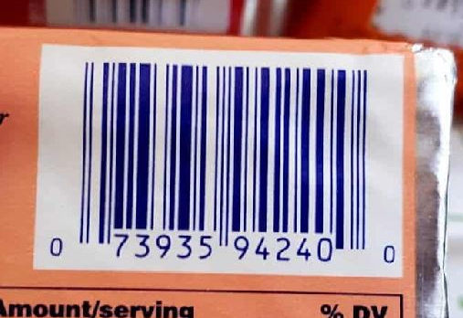
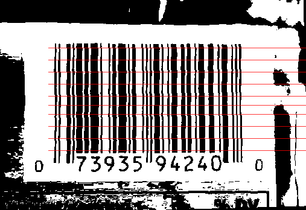

# Barcode Scanner
Scan a UPC-12 barcode in python from an image.

The code works by first thresholding the image to identify the light and dark areas, and then scanning horizontally along the barcode over a range of lines up and down the barcode to get an average of the length of bars which can then be decoded. This averaging helps to decode images that aren't perfectly straight or where there is variation in the width of bars in images with a small number of pixels.




The code is capable of decoding screenshots/good images of barcodes when the image is reasonably straight. It will fail for images that don't have suitable contrast between the dark and light bars, or where there are parts of light strips that would be below the threshold to be detected as dark. These will be detected as extra strips and will currently fail to decode. One example of images that may fail is pictures taken of screens, as seen below, where the lines and pixels visible in the image may be counted as extra bars.


The X and Y coordinates can be set, along with the range of Y offsets to scan over. The X coordinate should be set so that the scan starts in the quiet zone before the first dark strip of the barcode.

## Usage
- Open an image using PIL and convert to greyscale
```
from PIL import Image
img = Image.open(IMAGE_PATH)
img = img.convert("L")
```

- Edit the image as necassary to centre the barcode, rotate it, and detect the position of the barcode

- Initialise the BarcodeReader object
```
bc = BarcodeReader(img, debug=True)
```

- Set the appropriate starting X coordinate and range of Y coordinates for the particular image
```
bc.start_x = 80
bc.y_offsets = [-95, -75, -55, -35, -15, 0, 15, 35, 55, 75]
```

- Decode the barcdode
```
decoded_barcode = bc.decode()
```

## To Do's
- Implement detection of the limits of the barcode to avoid these values having to be entered by the user
- Implement detection of the barcode in a busy image (could use edge detection or trying multiple threshold values)
- Refactor to read the barcode using a state machine that allows the numbers to be decoded on the fly
- Update implementation to work with EAN-13 barcodes (these are equvalent to UPC when the initial digit is 0, but are encoded differently for other starting numbers)